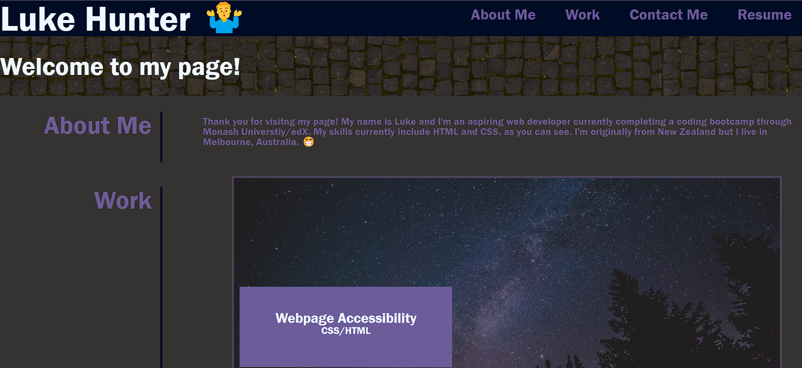
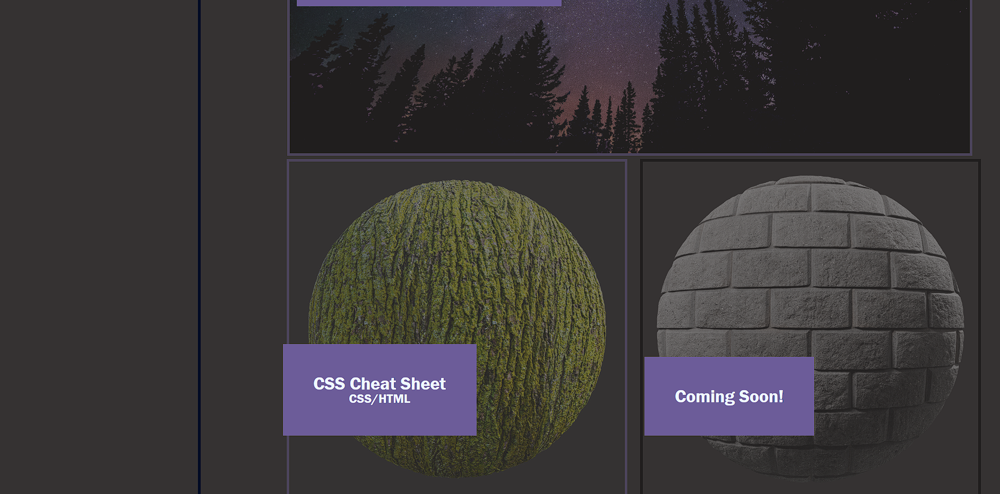
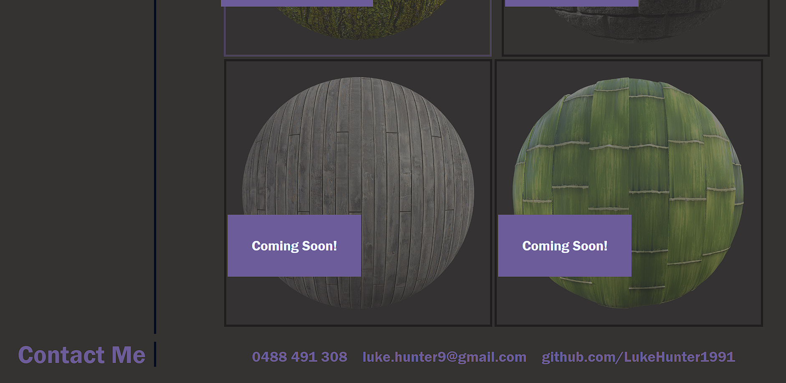

# Personal Webpage

## Code Locations

HTML - https://github.com/LukeHunter1991/01_personal_webpage/blob/main/index.html

CSS - https://github.com/LukeHunter1991/01_personal_webpage/tree/main/assets/css

Website - https://lukehunter1991.github.io/01_personal_webpage/

## Description

I decided to create a personal webpage as a simple way to show my work online. As I continue to complete projects each week I wanted to create a webpage that can show my portfolio while itself showcasing some of the skills that I have learned. In building this project I improved my skills with HTML and CSS. Specifically, I learned a lot about general layout/styling practices to help my webpage look professional at different screen sizes, including utilising media queries. I also greatly improved my knowledge of pseudo classes to help make my page more responsive and interactive.

## Table of Contents

- [Installation](#installation)
- [Usage](#usage)
- [Credits](#credits)

## Installation

No installation steps necessary. This webpage is hosted on Github pages.

## Usage

This webpage is used to show case my work. It includes a navigation bar at the top, which will link to the relevant section in the page. There are currently 2 active projects linked in the work section. The contact section includes my mobile number, email, and github profile.

## Credits

All coding completed by me, Luke Hunter. Some 3D assets/preview images licensed from Poliigon - https://www.poliigon.com/

